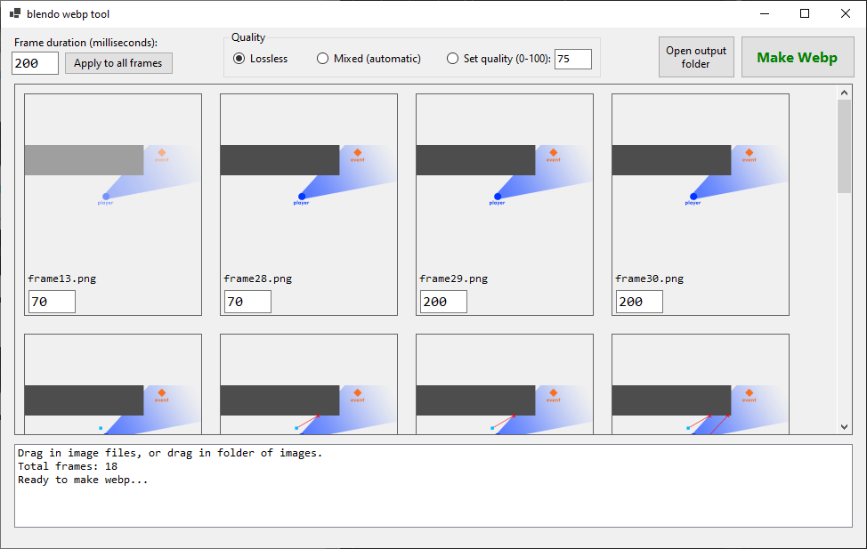

# Blendo Webp Tool
 

## About
Blendo Webp Tool is a utility for making animated webp images.

## Features
Drag a bunch of images into the window, and it will convert them into an animated webp file.

## Download
If you want to download and use this tool, it's [available here](https://blendogames.itch.io/blendo-webp-tool).

## License
This source code is licensed under the MIT license.

## Credits
- by [Brendon Chung](https://blendogames.com)

## Libraries used
- [img2webp](https://developers.google.com/speed/webp)

